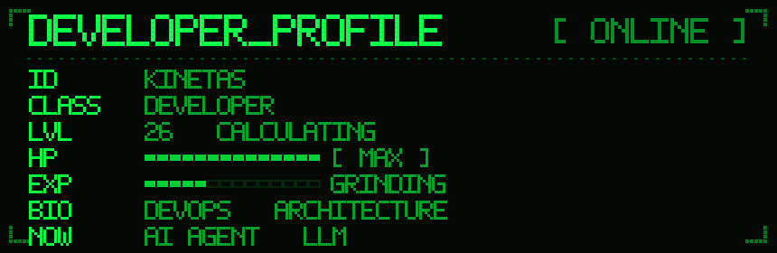
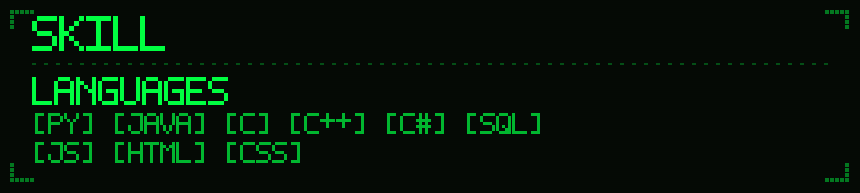

<!-- PIXEL ART: 상단 배너 -->

<!-- TYPING SVG: 부팅 화면 타이핑 효과 -->

<!-- PROFILE VIEWS: 방문자 카운터 -->

 

---

 

&nbsp;&nbsp;

---

---

## 🏆 ACHIEVEMENTS

<!-- GITHUB TROPHIES: 게임 업적 트로피 -->

---

## 📊 STATS BOARD

<!-- GITHUB STATS + TOP LANGUAGES -->
<!--  -->
<!--  -->

  

<!-- STREAK STATS: 연속 기여일 -->

---

## 📈 ACTIVITY LOG

<!-- ACTIVITY GRAPH: 기여 히트맵 -->

---

<!-- PIXEL ART: 하단 배너 -->

